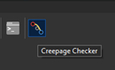
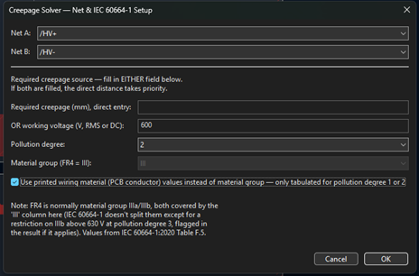
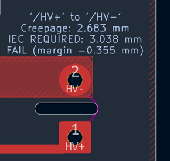
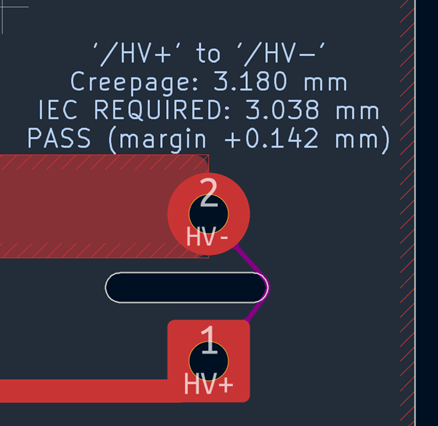
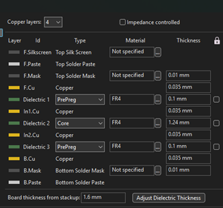
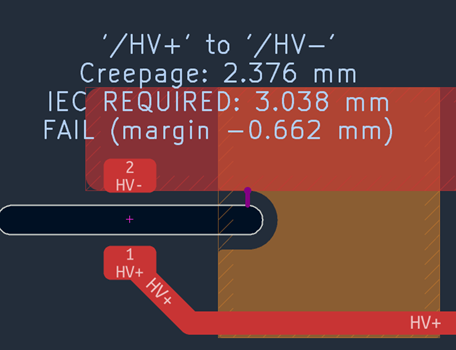
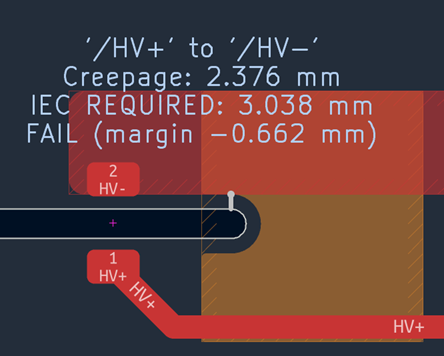
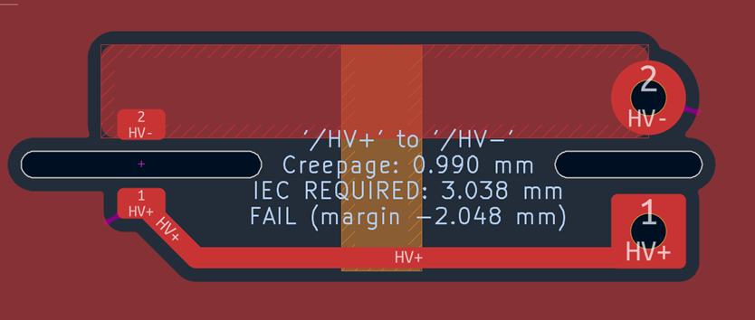
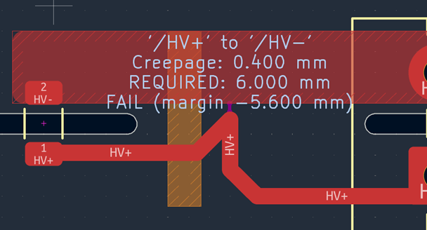

# Creepage Checker

KiCad 10 ActionPlugin for automated creepage distance verification per IEC 60664-1:2020.
The credit goes to Claude AI since my programming skills are limited!

## Features
- Exact segment-to-segment closest-point creepage measurement (Ericson's method)
- IEC 60664-1:2020 Table F.5 working-voltage lookup with linear interpolation (10V–1000V)
- Cross-layer measurement via pure dielectric gap (copper thickness excluded)
- Obstacle-aware routing around third-net pads/zones
- File-based .kicad_pcb stackup parsing
- wxPython configuration dialog for net pair selection, pollution degree, and material group

## Installation
1. Copy `creepage_checker.py`, `__init__.py`, and `creepage_checker.png` into your KiCad scripting/plugins folder
2. Restart KiCad or refresh plugins

## Usage
Select the plugin from the KiCad PCB Editor toolbar, choose your net pair, and either enter a required creepage distance directly or specify a working voltage for automatic IEC 60664-1 lookup.

*The Creepage Checker toolbar button in KiCad's PCB Editor*

*The Creepage Checker configuration window*

*Zone to Pad creepage around PCB slot*

*Pad to Pad creepage around PCB slot*

*PCB stackup*

*Top copper to slot edge distance*

*Slot edge to In.2 copper distance*

*Creepage by a third copper geometry*

*Trace to zone creepage distance*

## Notes
Creepage distance requirements are based on Table F.5 of IEC 60664-1:2020.

Known limitation (not a bug): sub-tolerance positional offset (not distance error) in KiCad's own round-cap tessellation at default poly_error_iu; confirmed to scale down roughly linearly with tighter tessellation tolerance via independent testing, tunable at the poly_error_iu constant.

Drawing Layers
Result text (net names, creepage/required/verdict) is placed on User.Comments.
Path visualization (the drawn creepage path and contact-point markers) uses a layer chosen by which copper layer the path segment is actually on:

F.Cu path segments → drawn on F.Adhesive

B.Cu path segments → drawn on B.Adhesive

Any inner copper layer (In1.Cu, In2.Cu, etc.) → drawn on Dwgs.User, since there's no dedicated adhesive layer per inner copper layer

Cross-layer (Z-axis) transitions are not drawn as a visible segment — only the dielectric-gap distance is added to the total. There's no via graphic placed at these points.
All drawn objects (text and path geometry) are tagged with a fixed stroke width (magic_width, currently 0.152mm) or a fixed marker width, which the plugin uses to identify and delete its own output from a previous run before drawing new results — so re-running on the same board doesn't leave stale text/paths behind. If you manually draw anything on User.Comments, F.Adhesive, B.Adhesive, or Dwgs.User at that same stroke width, it may get swept up by that cleanup on the next run.

## Changelog

### v189.5
Starting from v189.0's spatial-indexing rewrite, five further changes were made, three of which are real correctness fixes (not just performance):
Performance (v189.1–v189.2): Added profiling instrumentation to find the next bottleneck, which revealed that edge_cuts_bboxes was still a full unindexed linear scan inside get_grid_mask — v189.0 had indexed obstacle_polygons but missed this separate check, accounting for ~120s of a ~386s profiled run (260 million Contains() calls). Indexed it the same way, and memoized get_is_portal (previously called 11 million times with no caching). Net effect: pathfinding time roughly halved again beyond v189.0's initial improvement.
Correctness fix — unrestricted layer transitions (v189.3): The pathfinding loop allowed jumping between copper layers at any obstacle-adjacent location, regardless of obstacle type. Correct for real through-board holes (NPTH, slots, vias, the board edge) but wrong for a third-net pad or zone that only exists on specific layers — there's no actual hole there. This could produce a physically nonexistent shortcut, confirmed on a real board (1.568mm reported where no via/hole/slot existed at all). Fixed by requiring a genuine through-board discontinuity before permitting a layer transition, in both the main pathfinding loop and a second, independent search function that had the same unguarded assumption.
Correctness fix — unconditional cross-layer override (v189.4): A comparison step meant to replace a possibly-corrupted A(times) path length with a more trustworthy direct calculation was firing far too broadly — it replaced the current path with any cross-layer answer found, without checking it was actually shorter. This overwrote a correct, shorter same-layer route with a longer cross-layer "shortcut" through an unrelated obstacle. Fixed by only allowing the override when the current path's own treatment of that specific obstacle was already cross-layer (the actual scenario the protection was meant for).
Correctness fix — layer-collapsing in the global search (v189.5): The deepest of the three bugs. A helper function used by the global arc search collapsed all copper layers to a single "closest overall" answer at each point it checked, silently discarding any other layer's equally-valid (or better) candidate at that same location — even when the underlying copper was geometrically identical across layers. This caused two physically identical scenarios, differing only in which layer a zone sat on, to report different creepage distances (2.789mm vs. 2.683mm) when they should have matched exactly. Fixed by tracking the closest point per layer, not collapsed. This is the broadest-impact fix of the three — it affects accuracy on any multi-layer board where an obstacle sits near copper with asymmetric geometry across layers.
Net result: all three correctness fixes moved measured creepage numbers upward (correcting understated distances, the unsafe direction of error) or brought previously-mismatched layer-symmetric results into agreement, and every fix was verified against real board data with before/after comparisons plus regression checks on unrelated, already-correct net pairs.

### v189.0
Major architecture change: spatial indexing
Problem: on a complex real board (3,834 obstacles, vs. 2–295 on earlier test boards), every core geometry lookup — grid cell classification, line-of-sight checks, via-conductor edge search — worked by linearly scanning the entire relevant list with bounding-box pre-checks. That scales fine into the hundreds of items; at thousands, combined with pathfinding visiting millions of grid cells, it becomes billions of comparisons. Confirmed via profiling: 49 minutes total runtime on a real board, with via-conductor search alone consuming 30 minutes for just 6 non-pruned conductors.
Fix: every obstacle, hole edge, and HV edge now gets bucketed into a coarse 2mm spatial grid once, up front. A lookup for "what's near this point" now only checks items in the relevant bucket(s) instead of the full list. Applied in three places:

get_grid_mask — pathfinding's per-cell obstacle classification (was the largest single cost by raw multiplication: obstacle count × cells evaluated)
_tuple_los / exact_los — visibility checks, previously scanning all of exact_hole_edges on every call; fires heavily inside the via-conductor search
Via-conductor search's HV-edge lookup — bucketed per copper layer, queried with a margin equal to the current best-known distance (a safe bound, not an approximation — any HV edge farther away provably can't win)

Measured result on a real 3,834-obstacle board (identical net pair, before/after):
Stagev188.11v189.0SpeedupVia-conductor search1817.81s1.66s~1095xPathfinding1095.73s192.70s~5.7xTotal2949.93s (49 min)229.94s (3.8 min)~12.8x
Correctness: result confirmed identical (8.009mm) before and after — the indexing changes how candidates are found, not the answer. This matters because spatial indexing is exactly the kind of change that could silently miss a valid candidate if implemented incorrectly; getting the same number is the evidence it didn't.
Remaining bottleneck: pathfinding is now ~84% of total runtime (still visiting the same 2,944,472 cells as before — this change made classifying each cell faster, not the search itself smaller). That's the next target.

### v188.9–v188.11
Progress dialog polish
Replaced iteration-count-gated pulses (silently stopped updating entirely whenever a stage had fewer iterations than the gate threshold) with a wall-clock time throttle inside _progress() itself
Added a pulse inside the per-edge loop of a single conductor's search, so one large conductor (e.g. a whole-board ground pour) shows live progress during its own processing, not just between conductors
Widened the dialog via a longer initial placeholder message, and shortened per-stage message strings, fixing text wrapping that clipped the elapsed-time display

### v188.8
Performance: proximity-sorted pruning
Sorted each conductor's edges by proximity to the HV+/HV- region before the main loop, so the pruning bound tightens almost immediately instead of only after scanning edges in arbitrary polygon order. Cut via-conductor search time roughly 11x on a real test board (135.67s → 12.16s) with identical results confirmed across three independent runs.

### v188.7
Timing instrumentation
Added explicit timing brackets around the via-conductor search and final drawing/tagging stages, closing a gap where ~136s of runtime was previously unaccounted for in the log

### v188.5–v188.6
Performance: via-conductor search
Unpruned search over every third-net conductor (dozens on a complex board) × every edge × every HV edge became the dominant cost once zone holes were correctly counted (more edges per zone). Added bounding-box pruning at the conductor level (v188.5) and the edge level (v188.6), skipping pairs that provably can't beat the current best distance before running expensive exact math or visibility checks.

### v188.4
Progress dialog (initial)
Added wx.ProgressDialog with stage-based Pulse() updates, since KiCad plugins run synchronously and can look frozen on a large board

### v188.3
Bug fix: multi-piece board outlines
Board-outline exclusion only checked individual Edge.Cuts shapes before stitching — worked for a single RECT outline, but a real outline built from many segments/arcs (rounded corners) meant no single piece ever matched the full board extent, so the assembled outline got treated as a giant solid obstacle. Added a post-stitch check against the assembled ring's own bounding box.

### v188.2
Bug fix: zone clearance holes ignored
The third-net zone obstacle loop read only a zone's outer boundary, never its holes — treating an entire ground pour as solid copper, including where net A/B's own copper physically sits. Root cause of "NO PATH FOUND" on real boards with actual clearance holes. Added hole-aware obstacle membership check used everywhere obstacle geometry is tested.

### v188.1
- Added detailed raw-edge diagnostic logging for the winning HV+/HV- edge pair in the global direct search

### v188.0
- Added optional "Refill net A/B zones before measuring" checkbox to avoid stale zone-fill geometry affecting results

### v187.8
- Added Global Direct Minimum Search — exact segment-to-segment closest-point calculation independent of the 25µm pathfinding grid

### v187.7
- Fixed track geometry modeling to use KiCad's actual tessellated shape (round end caps), correcting a measurement discrepancy against KiCad's ruler tool

### v187.4
- Initial GitHub release

## License
GPL-3.0
